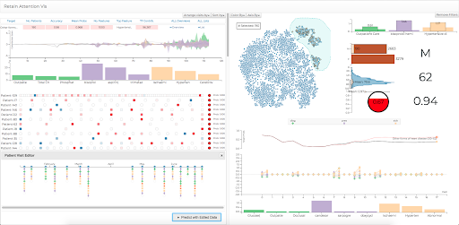

## RetainVis: Visual Analytics with Interpretable and Interactive Recurrent Neural Networks on Electronic Medical Records

Link to paper: [link](https://arxiv.org/abs/1805.10724)

#### Abstract
We have recently seen many successful applications of recurrent neural networks (RNNs) on electronic medical records (EMRs), which contain histories of patients' diagnoses, medications, and other various events, in order to predict the current and future states of patients. Despite the strong performance of RNNs, it is often challenging for users to understand why the model makes a particular prediction. Such black-box nature of RNNs can impede its wide adoption in clinical practice. Furthermore, we have no established methods to interactively leverage users' domain expertise and prior knowledge as inputs for steering the model. Therefore, our design study aims to provide a visual analytics solution to increase interpretability and interactivity of RNNs via a joint effort of medical experts, artificial intelligence scientists, and visual analytics researchers. Following the iterative design process between the experts, we design, implement, and evaluate a visual analytics tool called RetainVis, which couples a newly improved, interpretable and interactive RNN-based model called RetainEX and visualizations for users' exploration of EMR data in the context of prediction tasks. Our study shows the effective use of RetainVis for gaining insights into how individual medical codes contribute to making risk predictions, using EMRs of patients with heart failure and cataract symptoms. Our study also demonstrates how we made substantial changes to the state-of-the-art RNN model called RETAIN in order to make use of temporal information and increase interactivity. This study will provide a useful guideline for researchers that aim to design an interpretable and interactive visual analytics tool for RNNs.

#### Dependencies:
- Python 3.5+
- Pytorch 0.1.0

#### Files:
- train.py
  - code for training model on prediction task
- models/retain_ex.py
  - code for RetainEX model
- models/data_loader.py
  - code for loading and preprocessing dataset

#### Dataset:
- Records of patient visits provided by the Health Insurance Review & Assessment Service (HIRA)
- Unavailable for public use, can be replaced with other EMR datasets

Baseline model:
- RETAIN: An Interpretable Predictive Model for Healthcare using Reverse Time Attention Mechanism (NIPS'16). Choi et al.
- Patient Subtyping via Time-Aware LSTM Networks (KDD'17). Baytas et al.
- Incorporating Copying Mechanism in Sequence-to-Sequence Learning (ACL'16). Gu et al.
